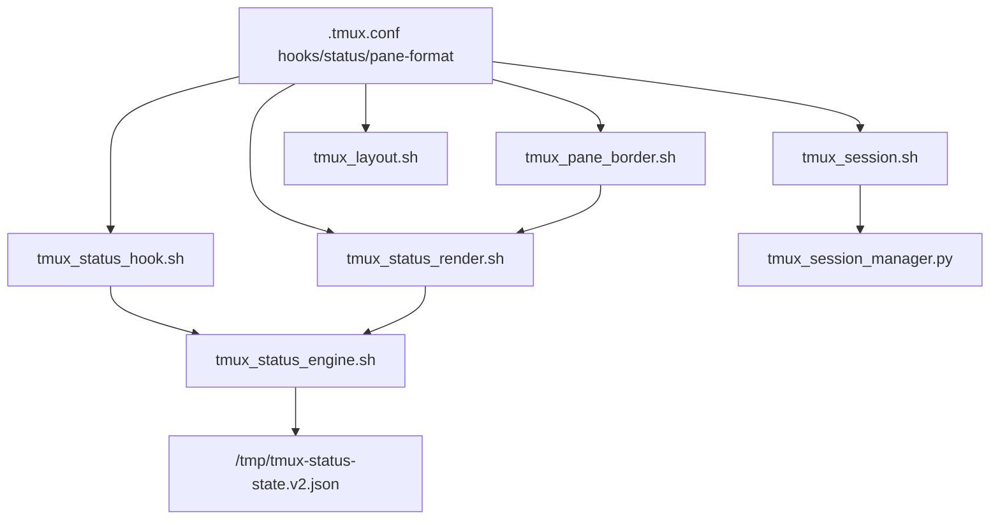

# tmux 脚本结构说明（合并版）

## 目录职责
当前目录仅保留一层脚本，不再使用 `scripts/` 和 `tmux-status/` 子目录。

- `tmux_session.sh`: 会话入口（新建、重命名、移动、切换、编号维护）。
- `tmux_session_manager.py`: 会话排序与重命名核心逻辑。
- `tmux_layout.sh`: pane 布局构建与横竖切换。
- `tmux_pane_border.sh`: pane border 文案与样式渲染（含 starship 标题逻辑）。
- `tmux_status_engine.sh`: 状态事件写入、状态查询、缓存与清理唯一入口。
- `tmux_status_render.sh`: status-left、window 后缀、pane 图标渲染入口。
- `tmux_status_hook.sh`: focus ack 与 codex notify 事件桥接入口。
- `tmux_theme.sh`: 主题色同步入口。

## 调用链

## 图标口径（统一规则）
- `🤖`: 按 `tmux list-panes -a` 中 `pane_current_command` 为 `codex*` 计数。
- `🔔`: 按状态文件中 `status=completed && acknowledged!=true` 计数。
- pane 级 `🔔`: 只判断当前 `pane_id` 是否存在未确认完成任务。

## 性能优化点
- 引擎新增短 TTL 查询缓存（默认 `300ms`）：`/tmp/tmux-status-query.v1.tsv`。
- window 状态后缀渲染合并为单次脚本调用，减少 status-format 进程数。
- `status-left` 改为批量查询，不再按 session 循环触发引擎子进程。
- focus ack 先判断 pane 是否有 bell，再决定是否写状态与刷新。

## 状态文件
- 默认路径：`/tmp/tmux-status-state.v2.json`
- 可覆盖：`TMUX_STATUS_STATE_FILE`
- 兼容旧变量：`TMUX_TRACKER_CACHE_FILE`

## 缓存相关环境变量
- `TMUX_STATUS_QUERY_CACHE_FILE`: 查询缓存文件路径
- `TMUX_STATUS_QUERY_CACHE_TTL_MS`: 缓存毫秒 TTL（默认 300）
- `TMUX_STATUS_QUERY_LOCK_DIR`: 查询缓存锁目录
