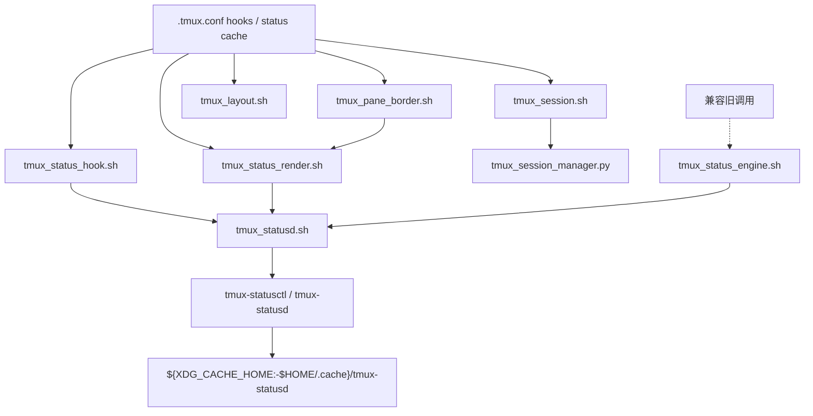

# tmux 脚本结构说明

## 目录职责
当前目录仅保留一层脚本，不再使用 `scripts/` 和 `tmux-status/` 子目录。

- `tmux_session.sh`: 会话入口（新建、重命名、移动、切换、编号维护）。
- `tmux_session_manager.py`: 会话排序与重命名核心逻辑。
- `tmux_layout.sh`: pane 布局构建与横竖切换。
- `tmux_pane_border.sh`: pane border 文案与样式渲染（含 starship 标题逻辑）。
- `tmux_status_render.sh`: 状态图标字符串渲染入口，按需读取 daemon 查询结果。
- `tmux_status_hook.sh`: focus ack、pane close、codex notify 的事件桥接入口，只向 daemon 发事件。
- `tmux_statusd.sh`: `tmux-statusd` / `tmux-statusctl` 的轻量包装与启动入口。
- `tmux_status_engine.sh`: 兼容旧调用方的薄包装，仅把 `query/event/gc` 转发给 `tmux_statusd.sh`，不再维护旧状态文件或旧查询缓存。
- `tmux_theme.sh`: 主题色同步入口。

## 调用链

## 图标口径
- `🧠`: 由 daemon 汇总 `pane_current_command` 为 `codex*` 的 pane 数量。
- `🔔`: 由 daemon 汇总 `completed && !acknowledged` 的任务数量。
- pane 级 `🔔`: 只判断当前 `pane_id` 是否存在未确认完成任务。

## 当前实现
- 主链路已经是 daemon-only：hook 只做 `emit`，render 只做 `query`，不再双写旧引擎状态。
- `status-left`、window suffix、pane border 的最终字符串通过 tmux option cache 提供，redraw 热路径不再依赖旧 shell 状态机。
- `tmux_status_engine.sh` 仅保留为兼容入口，不在当前 tmux 主链路热路径中。
- 旧状态文件、旧 shell 查询缓存、旧 fallback 查询逻辑都已移除。

## daemon 状态目录
- 默认路径：`${XDG_CACHE_HOME:-$HOME/.cache}/tmux-statusd`
- 可覆盖：`TMUX_STATUSD_STATE_DIR`
- 目录内容：`statusd.sock`、`state.json`、`health.json`、`events.jsonl`、`spool/`
